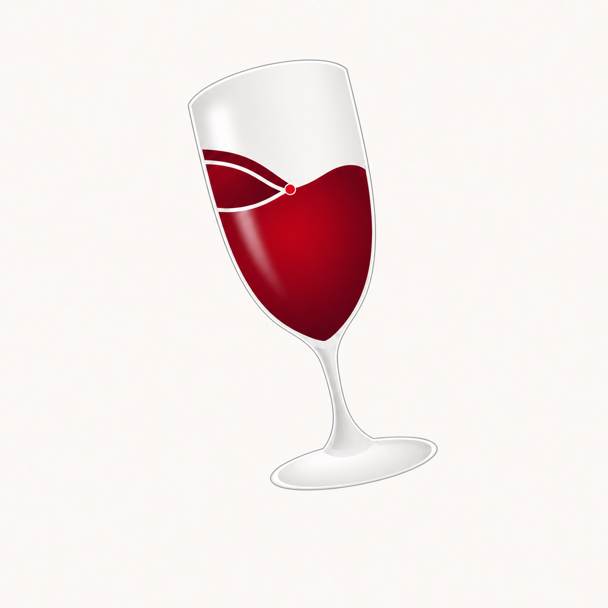
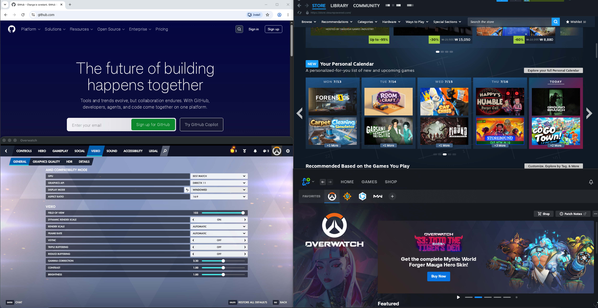

<p align="center">
  
</p>

# Switchyard

[](https://github.com/jungwuk-ryu/Switchyard/actions/workflows/ci.yml)
[](LICENSE)
[](https://support.apple.com/macos)

Switchyard is an experimental, open-source macOS app for running Windows game launchers and other executables in user-managed Wine containers on Apple Silicon.

> [!IMPORTANT]
> Switchyard is an early developer preview. Signed and notarized builds are available, but compatibility varies by application and containers should not be treated as a substitute for backups.

## Compatibility Preview



**One runtime. Real Windows apps. Apple Silicon.**

This July 2026 snapshot shows four different Windows workloads running side by side from Switchyard-managed containers: Chromium browser rendering, the Steam storefront, DirectX 11 game rendering, and the Battle.net launcher after sign-in. The tested runtime was built from [`switchyard-wine@f24f25e8c0`](https://github.com/jungwuk-ryu/switchyard-wine/commit/f24f25e8c098fc234d9996c4a63a71ebd1b1aaae).

This is a compatibility snapshot, not a blanket support guarantee. Results can vary by macOS version, hardware, application update, DRM, and anti-cheat requirements. Switchyard is an independent project and is not affiliated with or endorsed by Apple, Blizzard Entertainment, Google, Valve, or the owners of the applications and trademarks shown above.

## What Switchyard Does

- Creates Wine containers with portable manifests and last-used runtime provenance.
- Detects Apple Silicon, macOS, a user-selected Game Porting Toolkit installation, and a compatible Wine runtime.
- Runs install and launch plans through a separate `switchyard-runner` process.
- Records the active Wine build, source revision, and GPTK fingerprint most recently used by each container for diagnostics.
- Installs verified Noto fonts as open replacements for common Windows UI fonts.
- Bridges application-registered custom URL schemes back into the originating Wine container after a macOS browser login.
- Keeps diagnostic and debug logs local unless the user explicitly copies them.

The container model is launcher-agnostic. Steam, Battle.net, Epic Games Launcher, and GOG Galaxy are development targets, not guaranteed compatibility claims. Switchyard does not bypass DRM or anti-cheat systems.

## Runtime and License Boundaries

| Component | Source and license | Distribution boundary |
| --- | --- | --- |
| Switchyard app and runner | This repository, [MIT](LICENSE) | Developer ID signed and notarized releases, or built locally from Swift source |
| Patched Wine runtime | [`switchyard-wine`](https://github.com/jungwuk-ryu/switchyard-wine), LGPL-2.1-or-later | Recommended signed release pinned by [`config/switchyard-wine.env`](config/switchyard-wine.env), other trusted stable releases from the official runtime channel, or built locally |
| Apple Game Porting Toolkit components | Separately licensed Apple software | User-provided in the current release; never committed or bundled with Switchyard or Wine |
| Open Font Pack | Official Noto projects, SIL OFL 1.1 | Downloaded to a user-local cache and verified before installation |

The SwiftUI app does not link against Wine. Wine is replaceable and runs only through the external runner boundary. See [Licensing and redistribution](docs/licensing.md) for the complete policy.

The GPTK 3 review conditionally permits implementing a future separate, non-commercial component channel. That channel is not implemented in the current release and must pass the [version-specific legal release gate](docs/legal/gptk-3-redistribution-review.md), including independent legal sign-off, before it can be enabled. GPTK 4 and other unreviewed versions remain blocked.

## Requirements

- An Apple Silicon Mac running macOS 14 or later
- Xcode Command Line Tools with Swift 6
- Rosetta 2 for the x86_64 Wine runtime
- A locally obtained Apple Game Porting Toolkit installation for D3DMetal support

## Install the Preview

1. Download the current app archive from [GitHub Releases](https://github.com/jungwuk-ryu/Switchyard/releases/latest) and open Switchyard. Guided setup downloads and activates the recommended official Wine runtime.
2. Choose **Download from Apple** for Game Porting Toolkit. Apple handles account sign-in and license acceptance.
3. Return to Switchyard after the DMG finishes downloading and choose **Import Downloaded GPTK**. The app locates it in Downloads, verifies that its executable code is Apple-signed, and imports it into the local cache.
4. Re-run diagnostics and create a container.

The signed app pins the recommended runtime's exact archive size and SHA-256 for automatic setup. Under **Settings → Wine Runtime**, users can also download, activate, and remove stable releases from the official `switchyard-wine` GitHub channel. The manager restricts manifests and archives to that channel and the app's trusted Developer ID team; installation verifies each release's exact size and digest, Git source revision, safe archive paths, full extracted file-tree digest, supported architectures, and Developer ID signatures. The selected runtime is app-wide, never per-container. GPTK is never included in either release.

## Build and Verify

Clone the app repository and run the fast, runtime-independent checks:

```sh
git clone https://github.com/jungwuk-ryu/Switchyard.git
cd Switchyard
swift test
Tests/Shell/ensure_switchyard_wine_test.sh
Tests/Shell/runner_prefix_session_test.sh
Tests/Shell/runner_protocol_callback_test.sh
SWITCHYARD_SKIP_RUNTIME_ENSURE=1 ./script/build_and_run.sh --verify
```

To synchronize the pinned Wine source, build its user-local runtime, assemble the app bundle, and launch Switchyard:

```sh
./script/build_and_run.sh
```

The first full source build can take a while. Wine source, build products, imported GPTK files, containers, and logs remain outside this repository. The Wine build prerequisites and provenance model are documented in [`switchyard-wine`](https://github.com/jungwuk-ryu/switchyard-wine).

## Repository Layout

- `app/Switchyard`: SwiftUI app shell and platform integration
- `app/Packages`: portable models, job planning, runtime detection, and persistence
- `runtime/runner`: external Wine workload execution boundary
- `config/switchyard-wine.env`: immutable Wine source pin
- `script`: local build, verification, and runtime synchronization entrypoints
- `Tests`: Swift package and shell integration tests
- `docs`: architecture decisions, development notes, privacy, testing, and licensing

Start with [Architecture](docs/architecture.md) and [Development](docs/development.md). Contributions are welcome through [CONTRIBUTING.md](CONTRIBUTING.md); report vulnerabilities according to [SECURITY.md](SECURITY.md).

## License

Switchyard app and runner code are available under the [MIT License](LICENSE). The patched Wine runtime and third-party components retain their own licenses and distribution requirements.
