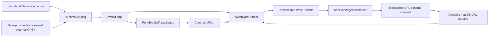

# Architecture

Switchyard separates UI, portable planning logic, process execution, and third-party runtime code so each boundary can be tested and licensed independently.

## Components

### App Shell

`app/Switchyard` owns scenes, views, platform dialogs, preferences, and orchestration state. Views call `AppStore`; they do not execute shell commands directly.

### Core Packages

- `AppCore`: portable models, command plans, and path/environment policies
- `JobEngine`: generic install and run planning plus font preparation
- `Persistence`: portable container manifests and rebuildable indexes
- `RuntimeCatalog`: macOS host checks, GPTK disk-image inspection, release-gated GPTK component verification, Wine discovery, source-pin validation, and font compatibility rules

These packages do not own SwiftUI state. `RuntimeCatalog` may invoke narrow macOS host tools such as `hdiutil`; it does not launch Wine or Windows workloads.

### Runner

`runtime/runner` is the only boundary that executes Wine and Windows workloads. It accepts a serialized `CommandPlan`, constructs an explicit process environment, streams output, handles cancellation, and returns the child status. The runner also appends structured output to a protected, bounded per-container live journal. `AppStore` tails that journal off the main thread and reconnects to it after app relaunch when the container's `wineserver` is still active. Application-specific compatibility behavior belongs in the runtime source, not in the runner.

The runner also accepts protected URL callback request files from the bundled `switchyard-url-handler` helper. It validates the requested scheme and prefix, deletes the request file before launch, and delivers the unchanged URL through `wine start` in that prefix. Callback URLs never appear in runner command-line arguments or Switchyard logs.

### Browser Login Callback Bridge

Wine exports the custom protocols registered in each prefix to a small versioned manifest. The runner starts one Wine-side registry monitor per active prefix, so direct changes under the user or machine `Software\Classes` keys refresh the manifest even when an application does not send a shell association notification. The app watches those manifests and generates one lightweight LaunchServices proxy bundle per scheme. No launcher or game scheme is hardcoded. Standard host schemes such as `http`, `https`, and `file` are rejected, and Switchyard does not replace a handler already owned by another native app.

When Safari or another macOS browser opens a callback, the proxy selects the most recently activated container that registered the scheme and hands a protected one-shot request to `switchyard-runner`. The runner synchronizes that scheme's per-user registration into Wine's class root before calling `wine start`, compensating for Wine's incomplete `HKCU\Software\Classes` merge. This keeps macOS registration and app lifecycle policy in the app repository while the Windows registry enumeration remains in the Wine runtime repository.

Some launchers do not register their callback scheme at all. For that case, the selected container offers an explicit recovery action: the user copies Safari's rejected callback URL, and Switchyard inspects the container's running Windows processes. It rejects Wine infrastructure and helper processes, proceeds automatically for a single application target, and asks the user to choose when several remain. Executables on any canonical Wine DOS drive mapping are eligible. The first callback is sent directly to the selected executable; only after Wine accepts it is the learned scheme-to-executable association stored per container, registered under the Wine user's protocol classes, and reused by the macOS proxy for later callbacks. Existing Wine protocol commands are never overwritten. The callback itself still travels only through a mode-0600 one-shot request file; its URL and sign-in token are neither persisted in the learned association nor included in Switchyard's logs or its helper command lines.

### Runtime Source

Wine source, compatibility commits, provenance, and runtime build tooling live in [`switchyard-wine`](https://github.com/jungwuk-ryu/switchyard-wine). `config/switchyard-wine.env` pins an exact source commit. `script/ensure_wine_runtime.sh` synchronizes that commit into a user cache, verifies its source metadata, and hands off to the source-owned builder.

The app presents the recommended pinned source revision's immutable Git timestamp as a UTC calendar build number in `YYYYMMDD.HHmm` form. `config/switchyard-wine.env` records that timestamp beside the revision, and source synchronization verifies the pair before building. Runtime settings list stable official `switchyard-wine` GitHub releases, install them into the immutable user-local runtime cache, and persist one active selection. Local source overrides omit the pinned timestamp rather than inheriting stale version metadata. Display values do not replace provenance: runtime IDs, immutable source revisions, release archive digests, and content fingerprints remain the authoritative compatibility and execution identities.

GPTK remains separately licensed Apple software. The app stores an imported user-local copy and compatibility fingerprint, whether the source was a user-selected Apple download or a separately hosted component artifact admitted by the version-specific legal release gate. GPTK is never part of this repository, the app bundle, a Wine runtime, or a combined Switchyard release artifact.

The optional GPTK component path reads a bundled, release-disabled policy from `config/gptk-component.env`. A complete policy pins a signed mutable channel-status document, one immutable HTTPS release manifest, and an Ed25519 public key. The status document supplies the remote disable control and pins the exact manifest digest; the release manifest pins the reviewed GPTK 3 source identities, archive, permitted paths, content tree, notices, and Apple signing identity. `RuntimeCatalog` performs the network and filesystem verification; `AppStore` owns license presentation, local acknowledgement records, and selection of the verified user-local path. The official Apple download/import path remains independent and available.

At launch, `JobEngine` points Wine's external DLL, dylib, and framework search paths at the selected GPTK `redist/lib` tree. This preserves the external runner boundary and does not copy Apple files into the immutable Wine runtime or a container.

## Data Model

Each container has a portable JSON manifest. The manifest is the source of truth and records the last-used Wine build, source identity, GPTK fingerprint, executable, environment overrides, schema version, and last-run status. Runtime provenance is diagnostic history, not a container-level selection or pin. Any future database must be a rebuildable index rather than the sole copy of container state.

Switchyard has one active Wine runtime and one active GPTK path selected in app settings. Every container operation snapshots and uses those app-wide components; neither can change while a container is running or transitioning. When the Wine runtime changes, an idle container is prepared automatically with `wineboot -u` on its next launch. GPTK remains externally injected and does not require prefix preparation. Users never choose or migrate runtime components per container. See ADR 0003.

## Decisions

- [ADR 0001: Runtime boundaries](adr/0001-runtime-boundaries.md)
- [ADR 0002: Container data model](adr/0002-container-data-model.md)
- [ADR 0003: Runtime update model](adr/0003-runtime-update-model.md)
