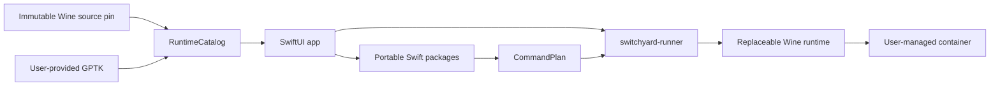

# Architecture

Switchyard separates UI, portable planning logic, process execution, and third-party runtime code so each boundary can be tested and licensed independently.

## Components

### App Shell

`app/Switchyard` owns scenes, views, platform dialogs, preferences, and orchestration state. Views call `AppStore`; they do not execute shell commands directly.

### Core Packages

- `AppCore`: portable models, command plans, and path/environment policies
- `JobEngine`: generic install and run planning plus font preparation
- `Persistence`: portable container manifests and rebuildable indexes
- `RuntimeCatalog`: macOS host checks, GPTK disk-image inspection, Wine discovery, source-pin validation, and font compatibility rules

These packages do not own SwiftUI state. `RuntimeCatalog` may invoke narrow macOS host tools such as `hdiutil`; it does not launch Wine or Windows workloads.

### Runner

`runtime/runner` is the only boundary that executes Wine and Windows workloads. It accepts a serialized `CommandPlan`, constructs an explicit process environment, streams output, handles cancellation, and returns the child status. Application-specific compatibility behavior belongs in the runtime source, not in the runner.

### Runtime Source

Wine source, compatibility commits, provenance, and runtime build tooling live in [`switchyard-wine`](https://github.com/jungwuk-ryu/switchyard-wine). `config/switchyard-wine.env` pins an exact source commit. `script/ensure_wine_runtime.sh` synchronizes that commit into a user cache, verifies its source metadata, and hands off to the source-owned builder.

GPTK remains user-provided local software. The app stores only a selected path, imported user-local copy, and compatibility fingerprint. It is never part of this repository or a Switchyard release artifact.

## Data Model

Each container has a portable JSON manifest. The manifest is the source of truth and records the Wine build, source identity, GPTK fingerprint, executable, environment overrides, schema version, and last-run status. Any future database must be a rebuildable index rather than the sole copy of container state.

The current preview launches through the globally selected compatible runtime. Enforcing the recorded per-container runtime, creating migration candidates, and preserving rollback metadata are planned work described by ADR 0003; they are not implemented yet.

## Decisions

- [ADR 0001: Runtime boundaries](adr/0001-runtime-boundaries.md)
- [ADR 0002: Container data model](adr/0002-container-data-model.md)
- [ADR 0003: Runtime update model](adr/0003-runtime-update-model.md)
